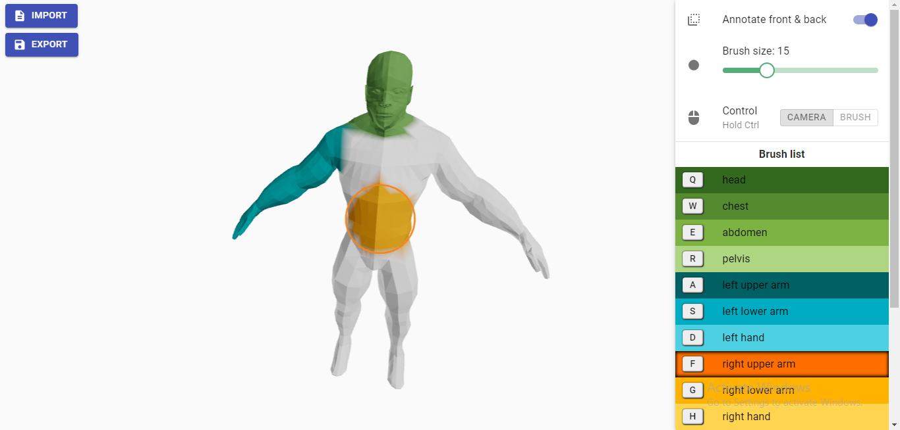

# Mesh Painter

Mesh Painter allows for the simple annotation of 3D meshes by painting vertices with a 2D brush. OBJ files can be imported and exported including the assigned vertex colors.

## Technologies used
- [React](https://reactjs.org/)
- [Three.js](https://threejs.org/)
- [Material-UI](https://material-ui.com/)
- [React-three-fiber](https://github.com/pmndrs/react-three-fiber)

# Getting started
`yarn install`\
`yarn start` - Runs the app in development mode.\
Open [http://localhost:3000](http://localhost:3000) to view it in the browser.

# Usage
- The tool can import and export the Wavefront .obj format. Similar to MeshLab and MeshMixer, vertex colors are stored after each vertex.
- Use the mouse to rotate (hold left mouse button), zoom (use mouse wheel), or pan (hold right mouse button) the camera.
- Choose a brush color by clicking on it or pressing the according key.
- Hold Ctrl and the left mouse button to brush vertices underneath the mouse cursor in the selected color.
- By changing the mouse default from camera to brush, brushes are activated by holding the left mouse button. To control the camera hold Ctrl.
- Alternatively, holding one of the brush keys will brush vertices independent of the current mouse default.
- By default, all vertices underneath the mouse receive color. E.g. when brushing the face of a model, the back head is also brushed.
By disabling "Annotate both sides", only front facing vertices are brushed.

# Issues

## Brushed area does not align with brush size
We currently color a point if the distance of this point to the shot ray is smaller than the brush radius. This is the equivalent to finding all points that intersect with an infinitely long cylinder around the mouse position. Due to the perspective camera, the brushed area appears to be smaller in the distance than in the front. To accomodate for this, we scale the brush indicator with the inverse length of the ray. However, even if the ray intersects with the mesh in the distance, points in the front can be colored due to the radius of the brush. This scenario might appear odd since the brush indicator radius is smaller than the actual cylinder radius for points in the front.

An alternative approach would be to keep the indicator radius equal at all times and shoot a cone instead of a cylinder. This means that distant points can be further away from the ray than points in the front and still be colored.

A second alternative is to color vertices in pixel space (hacky in the fragment shader) or coloring a texture based on UV coordinates (requires proper UV texture).

## Undo is not available
When the user accidentally brushes the object, all vertices in the brushed area are assigned a new color.
To undo such mistakes, we would need to store a history of brush actions together with all vertices that were brushed and there previous color. This requires O(vertices * actions) memory, which might be reduced through the introduction of an octree.

In order to keep the required memory low, one might store only the actions with all parameters (camera position, ray direction) and build the state from ground up by applying all actions to the initial model, saving memory while losing performance.

A mixed approach might store snapshots of the model and only apply actions from there, similar to how history is handled in git.

## Wavefront .obj groups are not supported
When loading an .obj file which contains groups, only the first group will be loaded.

# Assets
## Low poly male
by Dimas Alcalde Perelló\
https://www.cgtrader.com/free-3d-models/character/anatomy/low-poly-man-low-poly-male-free\
Royalty free licensing (https://www.cgtrader.com/pages/terms-and-conditions#general-terms-of-licensing)

## High poly male
by Orthovasky\
https://skfb.ly/6SFsR\
Creative Commons Attribution (http://creativecommons.org/licenses/by/4.0/).

# License

The source code is distributed under the MIT License. See `LICENSE` for more information.\
This license does not apply to the included assets.\
Icons are from [fontawesome](https://fontawesome.com/) under CC BY 4.0 License.

# Contact

Fabian Bolte - fabian.bolte@web.de